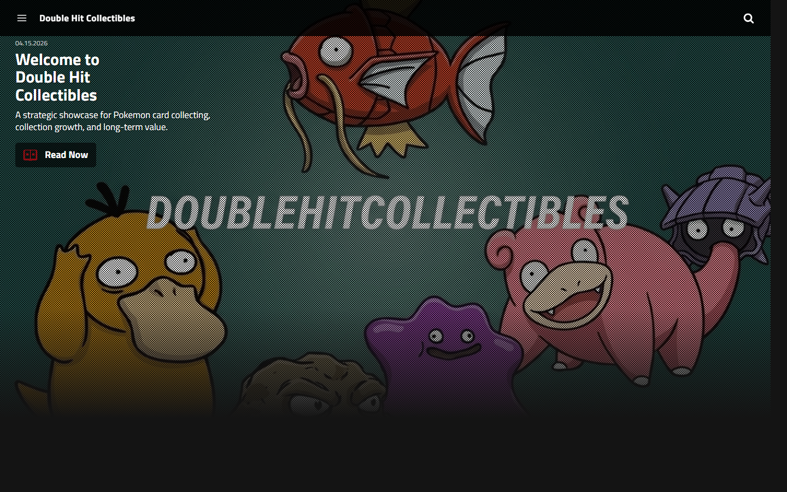
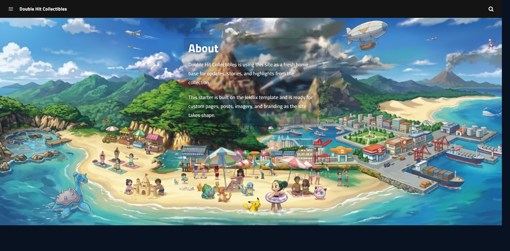

# Double Hit Collectibles

Double Hit Collectibles is the Pokemon trading card brand and collection website of Braden Lee (`0x00C0DE`).

This project is designed to present the collection in a polished, brand-forward format while documenting the long-term direction of the collection. The website combines visual identity, collection storytelling, and update-driven content to show that acquisitions are intentional, curated, and built with a clear purpose.

Live site: [doublehitcollectibles.github.io](https://doublehitcollectibles.github.io/)

## Live Site Preview

### Homepage



### About Page



## Project Overview

Double Hit Collectibles is being developed as a professional home base for:

- collection updates and featured highlights
- brand presentation and collector positioning
- public-facing storytelling around the collection
- future collection tracking and performance reporting

The current live site focuses on establishing the visual identity of the brand and creating a strong foundation for future collection content.

## Current Website Experience

The site currently includes:

- a branded homepage with featured post presentation
- custom Pokemon-themed imagery and collection-focused visuals
- an About page that introduces the brand and the purpose of the site
- a Contact page and RSS feed for communication and updates
- responsive navigation and GitHub Pages deployment

Today, the website functions primarily as a polished brand and content platform. Over time, it is intended to grow into a deeper collection showcase.

## Brand Positioning

Double Hit Collectibles is intended to communicate more than ownership. The brand is meant to show discipline, curation, and long-term thinking in how the collection is built.

The goal is to make it clear that the collection is not random inventory. Purchases are meant to reflect selectivity, quality standards, and a broader collecting strategy. That positioning helps build trust with collectors, customers, and collaborators who want to understand the reasoning behind the collection.

## Collection Roadmap

The longer-term direction of the site is to expand beyond updates and visual branding into collection intelligence.

Planned areas of growth include:

- individual card or collection feature pages
- acquisition notes and collecting rationale
- showcase pages for standout items and milestones
- collection organization by category, era, or priority

## Market Value Tracking Direction

One of the main roadmap ideas is to introduce collection performance tracking that compares:

- purchase price
- current market value
- unrealized gain or loss
- percentage return over time

That would allow the site to present the collection in a way that feels closer to a portfolio view, helping visitors understand how the collection is performing and how strategically it has been built.

Collectr-style tracking remains a concept under evaluation. If that direction is pursued, it should be implemented only through a stable and permitted pricing source, export workflow, or API that is reliable and compatible with the provider's access model and terms.

## Repository Purpose

This repository powers the public website for Double Hit Collectibles and contains the content, layouts, styling, assets, and deployment configuration used by the live GitHub Pages site.

## Tech Stack

- Jekyll for static site generation
- GitHub Pages for hosting
- Sass for custom styling
- JavaScript for interactive site behavior
- GitHub Actions for deployment automation

## Repository Structure

- `_posts/` contains website posts and featured content
- `pages/` contains standalone pages such as About and Contact
- `_layouts/` and `_includes/` contain the reusable page structure
- `_sass/` contains the site's styling and component-level presentation
- `assets/` contains compiled assets and image files used by the live site
- `src/` contains source configuration and build inputs
- `.github/workflows/pages.yml` contains the GitHub Pages deployment workflow

## Local Development

Install dependencies:

```bash
bundle install
npm install
```

Build the site:

```bash
npm run build
```

Run development tooling:

```bash
npm run dev
```

If you want to serve the site directly with Jekyll:

```bash
bundle exec jekyll serve
```

## Deployment

The production site is deployed through GitHub Pages.

- pushes to `main` publish the live website
- ongoing work can be developed on feature branches before being pushed to `main`

## Brand Ownership

- Brand: `Double Hit Collectibles`
- Owner: `Braden Lee`
- Handle: `0x00C0DE`
- Focus: `Pokemon trading cards`

## License

See [LICENSE](LICENSE) for the current license used in this repository.
